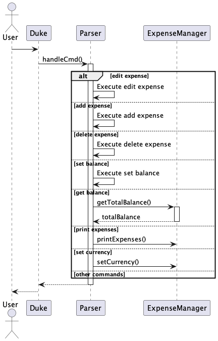
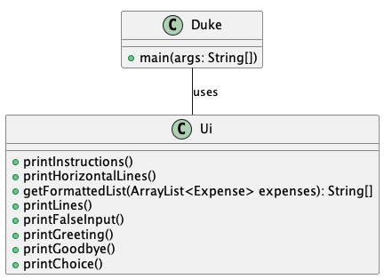
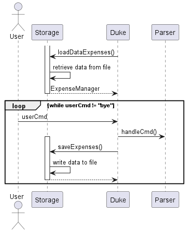
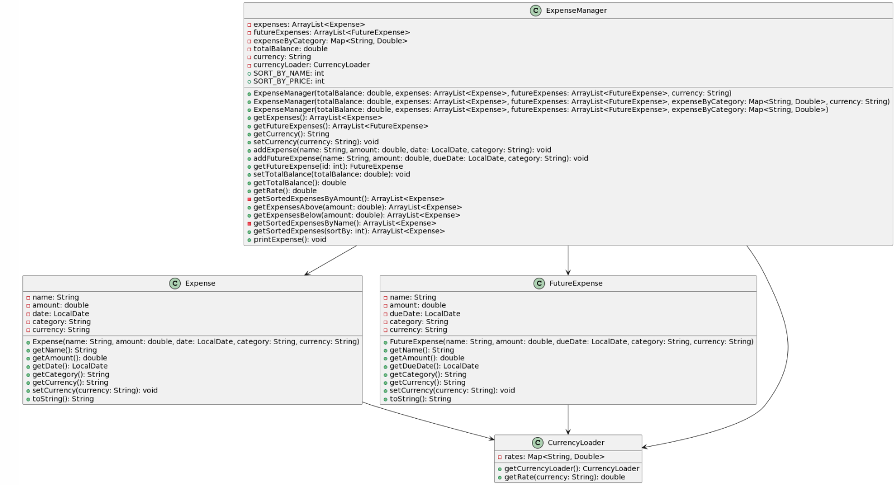
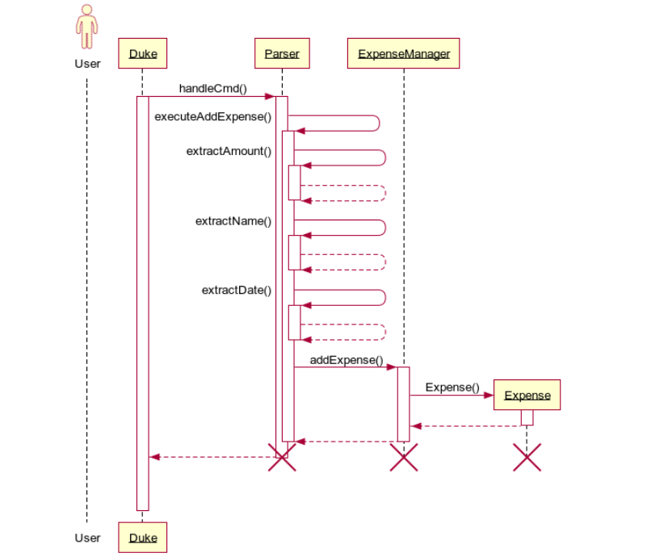
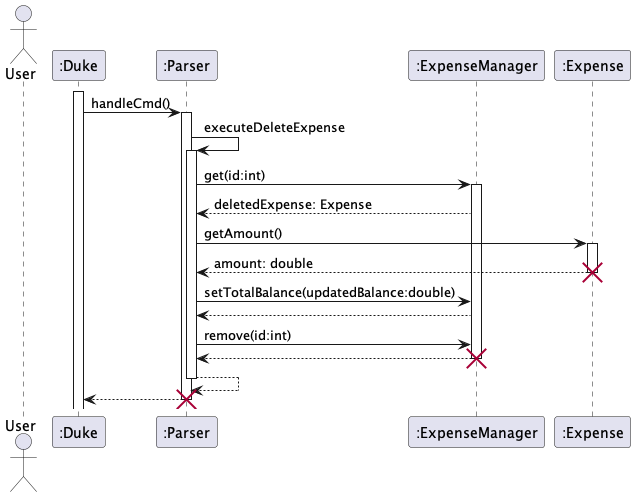
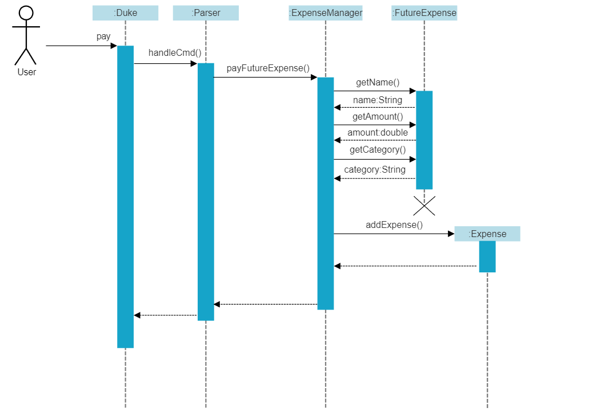
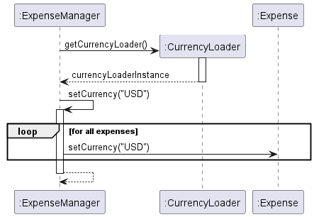

# Developer Guide

## Table of Contents

+ [Acknowledgements](#acknowledgements)
+ [Design](#design)
    * [Architecture](#architecture)
    * [Parser Component](#parser-component)
    * [UI Component](#ui-component)
    * [Storage Component](#storage-component)
    * [ExpenseManager Component](#expensemanager-component)
+ [Implementation](#implementation)
   * [Delete Expenses](#delete-expenses)
   * [Pay Future Expenses](#pay-future-expenses)
   * [Set Currency](#set-currency)
+ [Product Scope](#product-scope)
    * [Target User Profile](#target-user-profile)
    * [Value Proposition](#value-proposition)
+ [User Stories](#user-stories)
+ [Non-Functional Requirements](#non-functional-requirements)
+ [Instructions for Manual Testing](#instructions-for-manual-testing)

## Acknowledgements

The organisation and documentation of our project follows the recommended format of [AddressBook Level 3](http://se-education.org/addressbook-level3/DeveloperGuide.html).

## Design

### Architecture
Below is the high-level architecture diagram of the application.

### Parser Component
The `Parser` class handles the parsing of user input, executing the appropriate tasks
or throwing relevant errors.
* `Parser` first receives user input from `Duke` through `Parser::handleCmd`
* Depending on the command given, `Parser` will then execute the command on the `ExpenseManager`instance, or throw a `DukeException`, which will be caught by `Duke`
#### **Sequence Diagram**

### UI Component

The API of this component is specified in Ui.java \
The Ui class contains several static methods which display messages to the user when the user interacts with program.\
Types of messages displayed:

+ Instructions: Information message that describes the list of all commands of the application.
+ Greeting Messages: Messages shown to greet the user and acknowledge their exit.
+ Error Messages: Messages shown to inform the user that their input is invalid.
+ Category Choice: Displays category choices of expense to the user. \
  The class also prints text such as lines and the formatted list.

### Storage Component

The `Storage` class handles the validation and creation of the `duke_data.txt` file, which contains all the necessary
data regarding the user's budget and expenses.

#### Sequence Explanation

* Upon creation of the `Storage` object, the constructor first checks whether the directory and file
  `${CWD}/data/duke_data.txt` exists, and creates them otherwise.
* Before entering the main loop, `Duke` will first call `Storage::loadDataExpenses()`, which reads from `duke_data.txt`
  and initializes and *returns* a `ExpenseManager` object containing the budget, `Expenses` and `FutureExpenses` from
  the data file.
* Duke then uses the returned `ExpenseManager` object for the current session
* After every command, `Duke` will then call `Storage::saveExpenses(ExpenseManager)`, which serializes the current state
  of
  the `ExpenseManager` and writes the serialized data into `duke_data.txt`, making sure that the latest state of the app
  is always saved.

### ExpenseManager Component

The `ExpenseManager` class keeps track of the list of the class `Expense` and `FutureExpense` as well as
the `TotalBudget`. The class also contains methods that involve the creating, editing, listing of these items.

## Implementation

### Add Expenses
Adding expenses and future expenses feature is facilitated by the `Parser`, `ExpenseManager` and `Expense` and `FutureExpense` classes.\
The add command is used to add expenses and future expenses from the ArrayList `expense` and `future expense` respectively and updates the total balance accordingly.\
The sequence in which the `Parser` class handles the `add expense` command is as follows:
1. Assume the user input to be "add expenses Tuition $/2000 d/20230405"
2. The user input is sent to the `Parser` class which calls the `executeAddExpense` method based on the user command.
3. The method then extracts the necessary fields from the user command and add the expense into the `ArrayList<Expense>` all of the fields meet the requirements using the `addExpense` method in the class `ExpenseManager`.
4. The total balance is also updated using `addExpense` method in `ExpenseManager` class.
5. If the addition was a success, a message will be printed.

The implementation of `add future expense` is similar to `add expense` command as described above.

The sequence diagram below illustrates this adding mechanism:

### Delete Expenses
Delete past and future expenses feature is facilitated by the `Parser`, `ExpenseManager` and `Expense` and `FutureExpense` classes.\
The delete command is used to delete the past and future expenses from the ArrayList `expense` and `future expense` respectively and updates the total balance accordingly.\
The sequence in which the `Parser` class handles the `delete expense` command is as follows:
1. Assume the user has already added an expense and wants to delete that expense with expense_id 1 using the command: "delete expense id/1"
2. The user input is sent to the `Parser` class which calls the `executeDeleteExpense` method based on the user command.
3. The method then extracts the necessary fields from the user command and removes a expense object using the method `remove` from the `ExpenseManager` class if the expense id is a valid expense id in the list.
4. The total balance is also updated using `setTotalBalance` method in `ExpenseManager` class.
5. If the deletion was a success, a message will be printed through `executeDeleteExpense` in `Parser` class to notify the user that the expense object has been deleted.\

The implementation of `delete future expense` is similar to `delete expense` command as described above.

The sequence diagram below illustrates this delete mechanism: 

---

### Pay Future Expenses
#### Description
The pay future expenses feature is accessed by the `pay` command which is handled by the `Parser` class which calls a 
method in the`ExpenseManager` class and allows the user to set a `FutureExpense` as paid, thereby removing it from the
`futureExpenses` list and adding it to the `expenses` list.
The sequence in which the `pay` command is handled and processed is as follows.
1. The user input is sent to the `Parser` class which determines the index of the `FutureExpense` in `futureExpenses` to
be paid for.
2. The `Parser` class calls the `payFutureExpense` method in the `ExpenseManager` class and passes the index into it.
3. The `payFutureExpense` method extracts the `name`, `amt`, and `category` attributes from the `FutureExpense` then
constructs a new `Expense` with identical attributes and adds it to the `expenses` list.
4. The selected `FutureExpense` is removed from the `futureExpenses` list.

The sequence diagram below illustrates the pay mechanism: 

---

### Set Currency
#### Description
The `set currency` feature allows users to set the currency used by the app in various operations such as `list expenses`,
`add expense`, `check balance` etc.
#### CurrencyLoader
The list of exchange rates for the currencies **_against SGD_** are stored in a text file at `${PROJECT_ROOT}/src/main/resources/exchange_rates.txt`.
The list is hardcoded for the current version of the app in order to reduce complexity of the implementation, but  it should serve the users well enough
bar a drastic change in the exchange rates.
The currencies are loaded into the app through a _singleton_ class `CurrencyLoader`. Upon initialization of a `CurrencyLoader`
instance, the `exchange_rates.txt` file is read and then stored in the form of a `HashMap<String, Double>`, where the key is
"SGD", "USD", "MYR" etc. A singleton class is chosen for this feature in order to limit the reading of the `exchange_rates.txt`
file to only once as the file is static.

#### Getting the converted prices
Each class in the project (`Parser`, `ExpenseManager`, `Expense` etc.) will have access to the `CurrencyLoader` instance,
from which they can call `CurrencyLoader::getRate($CURRENCY)` in order to get the exchange rate for a currency. Then when
the user calls `set currency`, the `ExpenseManager` will call `Expense::setCurrency` for all its `Expense`s. Then when the
user calls `list expenses` or something, the price listed out will be `Expense.amount * CurrencyLoader.getRate(Expense.currency)`.
This way, all the prices for the expenses are kept (and normalized) to SGD, while its string representation is takes into account
the currency set. The same goes for `FutureExpenses` and `balance` as well.

## Product scope

### Target user profile

Our target user profile are people who want to be financially responsible and want to keep a track of their spending to
make informed financial decisions. The users include students, small business owners etc. who are interested in managing
their finances efficiently.

### Value proposition

Money master provides a fast and streamlined way for users to manage their finances. It helps the user manage their
finances quickly and efficiently by providing a convenient way to track their daily expenses. It allows the user to
create and track their budgets to prevent overspending and adjusting their expenses accordingly.

## User Stories

| Version | As a ...              | I want to ...                                           | So that I can ...                                                                      |
|---------|-----------------------|---------------------------------------------------------|----------------------------------------------------------------------------------------|
| v1.0    | budgeted student      | set a budget limit from which expenses are deducted     | track my expenses and avoid overrunning my budget                                      |
| v1.0    | new user              | add expenses                                            | plan my my expenditure based on the remaining budget                                   |
| v1.0    | forgetful user        | view my expenses                                        | remove incorrect or outdated entries from my transaction history                       |
| v1.0    | careless user         | edit my expenses                                        | modify or correct the entries in my transaction history                                |
| v1.0    | careless user         | delete my expenses                                      | remove incorrect or outdated entries from my transaction history                       |
| v1.0    | responsible user      | sort my expenses by date, name or amount                | have a clear timeline of how my budget has changed from the past to now                |
| v1.0    | responsible user      | add future payments                                     | budget accordingly based on expenses that will happen later on                         |
| v1.0    | careless user         | edit future payments                                    | modify or correct the entries of my upcoming expenses                                  |
| v1.0    | careless user         | delete future payments                                  | remove incorrect entries from my upcoming expenses                                     |
| v1.0    | responsible user      | view upcoming expenses within a period                  | stay informed of the upcoming expenses within that time period and budget accordingly  |
| v1.0    | responsible user      | pay future payments                                     | complete future payments and add the expenses to transaction history                   |
| v1.0    | responsible user      | remain informed of the remaining budget                 | complete my future payments by managing other expenses                                 |
| v2.0    | responsible user      | view my expenditure across different categories         | see which category is taking up the most budget                                        |
| v2.0    | international student | use the app in my home currency                         | conveniently make calculations                                                         |
| v2.0    | responsible user      | filter expenses by price                                | easily check which expenses cost more than $X amount, which can help with my budgeting |
| v2.0    | responsible user      | alerted when my future expenses are past their due date | quickly take action and resolve the future expenses if needed                          |
| v2.1    | responsible user      | clear all my expense data                               | start on a clean slate if needed                                                       |

## Non-Functional Requirements

1. Program should work on any operating system supporting Java 11 or above.
2. Does not require an active connection to the Internet to use the application.
3. Program should be accessible to users with no prior programming experience.
4. Program data will be saved persistently.
5. A user with above average typing speed for regular English text (i.e. not code, not system admin commands) should be
   able to accomplish most of the tasks faster using commands than using the mouse.

## Instructions for Manual Testing

### Launch

1. Download the JAR file and move it into an empty folder.
2. On a command line application, change the current working directory to the same folder as the JAR file and run the
   app using:\
   `java -jar tp.jar`
3. Expected: The app's welcome message is printed onto the terminal along with list of all commands.

### Add

#### Add past expense

1. Prerequisites:
    - Ensure that you enter a name for the expense
    - Ensure that a valid date is entered
    - Date is entered in the format: yyyymmdd
    - Ensure all fields are entered
2. Test case:
   `add expense book $/100 d/20230101`\
   Expected: Terminal shows choose category message. Enter a category number. Expense entry is added. Terminal shows
   successful message along with expenditure details (name, amount, date, category).

#### Add future expense

1. Prerequisites:
    - Ensure that you enter a name for the future expense
    - Ensure that a valid date is entered
    - Date is entered in the format: yyyymmdd
    - Ensure all fields are entered
2. Test case:
   `add future expense bill $/200 d/20230505`\
   Expected: Terminal shows choose category message. Enter a category number. Expense entry is added. Terminal shows
   successful message along with expenditure details (name, date, category).

#### Entering incomplete information

Test case: `add expense book $/100` or `add expense book d/20220101` or `add expense book`\
Expected: Terminal shows error message.

### Delete

#### Delete past expense

1. Prerequisites:
    - Ensure that a valid expense id is entered
    - Ensure all fields are entered
2. Test case:
   `delete expense id/1`\
   Expected: Expense entry is deleted. Terminal shows successful message along with expenditure details (name, amount,
   date, category).

#### Delete future expense

1. Prerequisites:
    - Ensure that a valid future expense id is entered
    - Ensure all fields are entered
2. Test case:
   `delete future expense id/1`\
   Expected: Expense entry is deleted. Terminal shows successful message along with expenditure details (name, date,
   category).

#### Entering incomplete information

Test case: `delete expense` or `delete expense id/12`\
Expected: Terminal shows error message.

### Edit

#### Edit past expense

1. Prerequisites:
    - Ensure that a valid expense id is entered
    - Ensure that a valid date is entered
    - Date is entered in the format: yyyymmdd
    - Ensure all fields are entered

2. Test case:
   `edit expense id/1 in/"amount/date/category/name"`\
   Enter type of the field to edit in the above format. \
   Expected: Terminal shows message to enter the information for the chosen field to edit. Successful message is shown
   on entering the information.

#### Edit future expense

1. Prerequisites:
    - Ensure that a valid expense id is entered
    - Ensure that a valid date is entered
    - Date is entered in the format: yyyymmdd
    - Ensure all fields are entered

2. Test case:
   `edit future expense id/1 in/"amount/date/category/name"`\
   Enter type of the field to edit in the above format. \
   Expected: Terminal shows message to enter the information for the chosen field to edit. Successful message is shown
   on entering the information.

### List

#### List past expense

Test case:
`list expenses`\
Expected: Terminal shows message to enter the number associated with the sorting type of expenses (by date/name/amount).
List of expenses is displayed based on the entered sorting type. If expense list is empty, terminal displays required
message.

#### List future expense

Test case:
`list future expenses`\
Expected: Terminal shows list of upcoming payments with the total amount due and current balance. A warning message is
displayed if the balance is insufficient.

### Balance

#### Set balance

1. Prerequisites:
    - Ensure all fields are entered

2. Test case:
   `set balance $/2000`\
   Expected: Terminal shows successful message.

#### Check balance

Test case:
`check balance`\
Expected: Terminal shows remaining balance.

#### Entering incomplete information

Test case: `set balance`\
Expected: Terminal shows error message.

### Upcoming Expenses

#### Check upcoming expenses

Test case:
`check upcoming expenses`\
Expected: Terminal shows message to choose period of upcoming expenses. Upcoming payments for the entered time period
are displayed with the total amount due and current balance. A warning message is displayed if the balance is
insufficient.

#### Pay upcoming expenses

1. Prerequisites:
    - Ensure that a valid future expense id is entered
    - Ensure all fields are entered
2. Test case:
   `pay 1`\
   Expected: Terminal shows successful message. The paid future expense is added to list of past expenses.

### Currency

#### Set currency

1. Prerequisites:
    - Ensure that a valid currency symbol is entered
2. Test case:
   `set currency USD`\
   Expected: Terminal shows successful message. 

#### Get currency

Test case:
`get currency`\
Expected: Terminal shows the currently set currency.

### List expenditure by category

Test case:
`list expenditure by category`\
Expected: Terminal displays the total expenditure across all categories.

### Filter expenses

#### Expenses above an amount
1. Prerequisites:
    - Ensure all fields are entered

2. Test case:
   `expenses above $/150`\
   Expected: Terminal displays all expenses of amount greater than the entered amount.

#### Expenses below an amount
1. Prerequisites:
    - Ensure all fields are entered

2. Test case:
   `expenses below $/2000`\
   Expected: Terminal displays all expenses of amount lower than the entered amount.

### Clear expenses 

#### Clear expenses 
1. Prerequisites:
    - Ensure you have already added expenses to your list, otherwise there will be nothing to clear
    
2. Test case:
   `clear expenses`\
    Expected: Terminal shows message to choose Y or N to remove all expenses. Based on the user input, the terminal displays the message. If there are no expenses in the list, the required message will be displayed.

#### Clear future expenses
1. Prerequisites:
    - Ensure you have already added future expenses to your list, otherwise there will be nothing to clear

2. Test case:
   `clear future expenses`\
   Expected: Terminal shows message to choose Y or N to remove all future expenses. Based on the user input, the terminal displays the message. If there are no future expenses in the list, the required message will be displayed.

### Shutdown

After the testing is done, type the command `bye` to exit the program\
Terminal will display a goodbye message and the application would close in the command-line interface.
